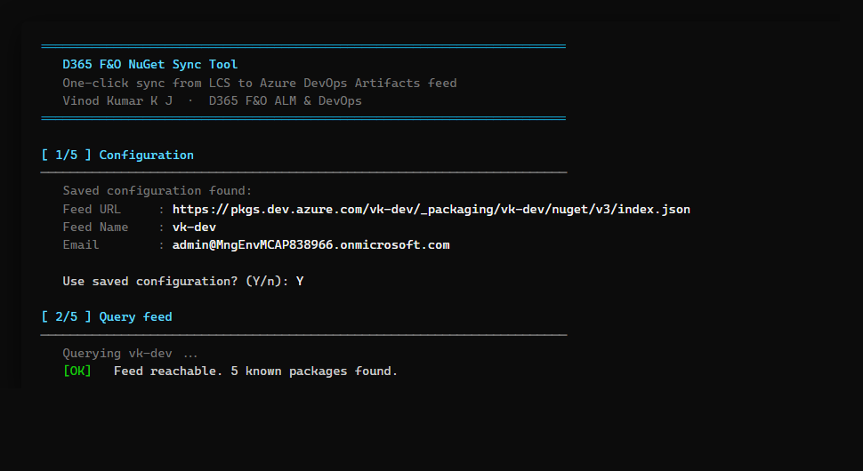
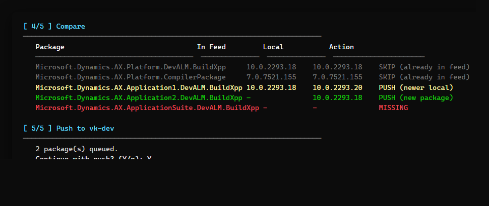
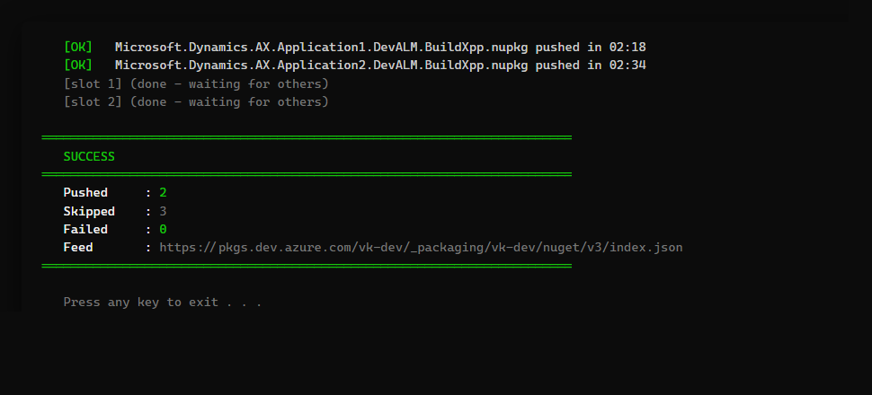

# D365 F&O NuGet Sync

**Copy your Dynamics 365 Finance & Operations NuGet packages from LCS into your Azure DevOps Artifacts feed — in one click.**

It checks your feed first and uploads only what's **missing or newer**, so you never wait on a big upload just to get a "version already exists" error.

---

## Get it (easiest way — works on any Windows PC)

1. Download **`Sync-D365FONuGet.zip`** from the [latest release](https://github.com/vjanardhana12/d365fo-nuget-sync/releases/latest).
2. Right-click the zip → **Properties → tick “Unblock” → OK**, then extract it.
3. Double-click **`Sync-D365FONuGet.bat`**.

That's it — no install, no PowerShell setup. The `.bat` just starts the tool for you.

> **Why the `.bat`?** Many workplaces block downloading or running `.exe` files. The `.bat` and `.ps1` inside the zip are plain text, so they get through — and the `.bat` launches everything with one double-click.
>
> **Other ways to run** (same zip): double-click **`Sync-D365FONuGet.exe`**, or run **`Sync-D365FONuGet.ps1`** in PowerShell.

---

## See it in action

**1. It remembers your feed settings and checks your feed:**

**2. It compares your feed with your local packages and shows exactly what it will do — then asks before pushing:**

**3. Done — only the packages that were missing or newer get uploaded:**

---

## First run — you'll enter 4 things

| Prompt | Example |
|---|---|
| **ADO Feed URL** | `https://pkgs.dev.azure.com/myorg/_packaging/MyFeed/nuget/v3/index.json` |
| **Feed Name** | any short label, e.g. `MyFeed` |
| **Email** | your Azure DevOps login |
| **PAT** | Personal Access Token with **Packaging (Read & Write)** scope — [create one](https://dev.azure.com/_usersSettings/tokens) |

The first three are remembered for next time (saved per-user). **Your PAT is never saved** — you type it each run.

---

## Example: upgrade your feed to a new platform version

1. In **LCS → Shared Asset Library**, download the D365 F&O NuGet packages for the version you want. You'll get **`.nupkg`** files (keep them as `.nupkg` — don't rename or unzip them).
2. Put those `.nupkg` files in the **same folder** as the tool (or point the tool to your Downloads folder when it asks).
3. Double-click **`Sync-D365FONuGet.bat`**.
4. It shows the compare table (like the screenshot above), asks **“Continue with push? (Y/n)”**, and uploads only what's missing or newer.

That's the whole loop — re-run it whenever a new platform version drops.

---

## The 5 packages it manages

The standard D365 F&O build references from the LCS Shared Asset Library:

- `Microsoft.Dynamics.AX.Platform.DevALM.BuildXpp`
- `Microsoft.Dynamics.AX.Platform.CompilerPackage`
- `Microsoft.Dynamics.AX.Application1.DevALM.BuildXpp`
- `Microsoft.Dynamics.AX.Application2.DevALM.BuildXpp`
- `Microsoft.Dynamics.AX.ApplicationSuite.DevALM.BuildXpp`

---

## Troubleshooting

| Problem | Fix |
|---|---|
| `Cannot reach feed` | The URL must end in `/nuget/v3/index.json`; check your PAT is valid. |
| `401 Unauthorized` | PAT expired or wrong scope — make a new one with **Packaging (Read & Write)**. |
| Push rejected (`409 Conflict`) | That exact version is already in the feed — Azure Artifacts won't overwrite it. |
| Windows blocks the `.exe` | Just double-click **`Sync-D365FONuGet.bat`** instead — same tool, no exe needed. |

---

## Good to know

- **Runs on** Windows PowerShell 5.1 or PowerShell 7+.
- **Auto-update:** the `.exe` checks GitHub on startup and offers to upgrade itself when a newer release exists.
- **LCS → PPAC:** these packages still live on the **LCS Shared Asset Library** today. Microsoft is moving LCS into the **Power Platform Admin Center (PPAC)**; the tool will be updated when that lands.

---

MIT licensed — free for personal and commercial use. Created by **Vinod Kumar K J**.
