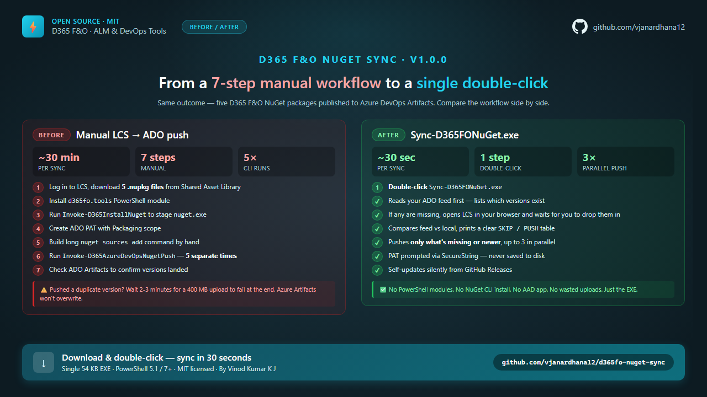

# D365 F&O NuGet Sync Tool

[%20%7C%207%2B-blue)](https://learn.microsoft.com/powershell/)
[](LICENSE)

**One-click sync of Microsoft Dynamics 365 Finance & Operations NuGet packages from LCS to your Azure DevOps Artifacts feed.**

> **v1.0.1** — smart feed comparison: only pushes packages that are missing or newer. **No more wasted uploads** trying to push duplicate versions Azure Artifacts won't accept. **Auto-update included** — checks GitHub on startup and prompts for upgrade if newer version is available.

---

## At a glance



| | Before (manual) | After (this tool) |
|---|---|---|
| **Time per sync** | ~30 min | ~30 sec |
| **Steps** | 7 manual | 1 double-click |
| **CLI invocations** | 5 (one per package) | 0 (just the EXE) |
| **Modules to install** | `d365fo.tools` + `nuget.exe` | None |
| **Pre-check for duplicates** | None — fails after a 400 MB upload | Reads feed first, skips what exists |
| **Parallel pushes** | No | Up to 3 |
| **PAT storage** | Often pasted into shell history | SecureString prompt, never written to disk |
| **Self-update** | Manual | Silent check on startup |

---

> **📌 Note on LCS / PPAC**
> As of April 2026, D365 F&O NuGet packages are still hosted on **LCS Shared Asset Library**.
> Microsoft is migrating LCS capabilities to **PPAC (Power Platform Admin Center)**. When that migration completes, this tool will be updated to point at the new location.

---

## Why this tool exists

The "official" path (published in most D365 F&O team runbooks) is:

1. Log in to LCS → Shared Asset Library → download 5 `.nupkg` files.
2. Install the `d365fo.tools` PowerShell module.
3. Run `Invoke-D365InstallNuget` to stage `nuget.exe`.
4. Create an ADO PAT with Packaging scope.
5. Build a long `nuget sources add -Name ... -Source ... -username ... -password ...` command by hand.
6. Run `Invoke-D365AzureDevOpsNugetPush -Path <nupkg> -Source <feed>` — **once per package in the core set**.
7. Check ADO Artifacts to see if versions landed.

Common failure: pushing a version that's already in the feed fails because Azure Artifacts won't overwrite immutable package versions. Old flow had no pre-check — you'd wait 2-3 minutes for a 400 MB upload just to see it rejected at the end.

**This tool replaces steps 2-7 with one double-click**: reads the feed first, skips what's already there, pushes up to 3 in parallel, no module install needed.

## What it does

1. **Reads your ADO feed** and lists which versions of the core D365 F&O package set (currently 5) it already has.
2. **Reads any `.nupkg` files** you've placed next to the script.
3. **Shows a clear table** — what's in the feed vs what's local, and what action is needed.
4. **If anything's missing**, it opens the LCS Shared Asset Library in your browser, tells you which packages to download, then waits for you to drop them in the folder.
5. **Pushes only what's needed** (skips packages already at the same version).
6. **No secrets stored** — PAT is prompted via SecureString every run.

```
   Package                         InFeed         Local           Action
   ──────────────────────────────  ─────────────  ──────────────  ──────────────
   Platform.DevALM.BuildXpp        7.0.7858.27    7.0.7858.27     SKIP (same)
   Platform.CompilerPackage        7.0.7858.27    7.0.7858.27     SKIP (same)
   Application1.DevALM.BuildXpp    10.0.2345.218  10.0.2527.42    PUSH (newer)
   Application2.DevALM.BuildXpp    10.0.2345.218  10.0.2527.42    PUSH (newer)
   ApplicationSuite.DevALM.BXpp    10.0.2345.218  10.0.2527.42    PUSH (newer)
```

---

## Quick start

**Easiest path — single EXE:**

1. Download **`Sync-D365FONuGet.zip`** — [direct download (~26 KB)](https://github.com/vjanardhana12/d365fo-nuget-sync/releases/latest/download/Sync-D365FONuGet.zip) · [release notes](https://github.com/vjanardhana12/d365fo-nuget-sync/releases/latest)
2. **Right-click the zip → Properties → tick "Unblock" → OK**, then extract it.
3. **Double-click `Sync-D365FONuGet.exe`** inside the extracted folder.

> **First-run notice (Windows SmartScreen):** Windows may show *"Make sure you trust Sync-D365FONuGet.exe…"* on first launch — this happens to every unsigned indie tool. Click **More info → Run anyway**. Since this is open source, every line is auditable in this repo before you run it.

That's it. No PowerShell knowledge needed, no script execution policies to fight, no module installs.

<details>
<summary><b>Prefer to run the source script?</b> (PowerShell)</summary>

```powershell
# 1. Clone or download the repo
# 2. Open Windows PowerShell 5.1 (recommended) — or PowerShell 7
# 3. cd to the tool folder
cd "C:\path\to\d365fo-nuget-sync"

# 4. Run
.\Sync-D365FONuGet.ps1
```

Or just **double-click `Sync-D365FONuGet.bat`**.

</details>

On first run you'll be asked for:
- **ADO Feed URL** (e.g. `https://pkgs.dev.azure.com/myorg/_packaging/MyFeed/nuget/v3/index.json`)
- **Feed Name** (any short label, e.g. `MyFeed`)
- **Email** (your ADO login)
- **PAT** (Personal Access Token with **Packaging (Read & Write)** scope)

The first three are saved per-user to `%LOCALAPPDATA%\d365fo-nuget-sync\.push-config` for next time. The PAT is **never** saved.

---

## Prerequisites

| Requirement | Notes |
|---|---|
| **Windows PowerShell 5.1** | Recommended — same shell most D365 F&O ALM/build pipelines use, so no version surprises. PowerShell 7+ also works (the tool only uses `nuget.exe` + REST + jobs — no D365 F&O modules), but pin to 5.1 if your wider toolchain is on 5.1. |
| **ADO PAT** | Scope: **Packaging (Read & Write)**. [Create one →](https://dev.azure.com/_usersSettings/tokens) |
| **LCS access** | Required only to download the packages. Browser access is enough — no AAD app, no API setup. |
| **Internet** | To download `nuget.exe` (one-time, ~6 MB) and reach the ADO feed. |

---

## Common scenarios

### Empty feed, first-time setup
```
.\Sync-D365FONuGet.ps1
→ Feed empty. Core package set missing (currently 5).
→ Opens LCS for you. Download the 5 packages, drop here, press Enter.
→ Pushes the full core package set.
```

### Routine version refresh
```
.\Sync-D365FONuGet.ps1
→ Compares feed vs local. Pushes only the newer ones. Skips the rest.
```

### Already up-to-date
```
.\Sync-D365FONuGet.ps1
→ "Nothing to push. Feed is already up-to-date." Done.
```

### Force re-push (rare)
```
.\Sync-D365FONuGet.ps1 -Force
```

### CI / unattended
```powershell
$env:ADO_PAT = '<pat>'
.\Sync-D365FONuGet.ps1 -FeedUrl '...' -FeedName MyFeed -Email me@x.com -NonInteractive
# In NonInteractive mode, missing packages cause failure (no prompt).
```

---

## How the feed check works

The script calls the standard NuGet v3 **flat container** API on your feed:

```
GET {feed}/v3-flatcontainer/{package-id-lower}/index.json
Authorization: Basic {base64(email:PAT)}
```

It picks the highest version returned and compares against the version inside your local `.nupkg` (read directly from the embedded `.nuspec`). Pure version-string comparison — no guessing.

---

## The 5 packages it manages

These are the standard D365 F&O build references published to LCS Shared Asset Library:

- `Microsoft.Dynamics.AX.Platform.DevALM.BuildXpp`
- `Microsoft.Dynamics.AX.Platform.CompilerPackage`
- `Microsoft.Dynamics.AX.Application1.DevALM.BuildXpp`
- `Microsoft.Dynamics.AX.Application2.DevALM.BuildXpp`
- `Microsoft.Dynamics.AX.ApplicationSuite.DevALM.BuildXpp`

---

## Troubleshooting

| Issue | Fix |
|---|---|
| `Cannot reach feed` | Check the feed URL (must end in `/nuget/v3/index.json`) and that your PAT is valid + has Packaging scope. |
| `401 Unauthorized` | PAT expired or wrong scope. Generate a new one with **Packaging (Read & Write)**. |
| `Conflict` / push rejected | The exact version is already in the feed. Azure Artifacts won't overwrite — bump the version in LCS first. |
| `nuget.exe` download fails behind a proxy | Set `$env:HTTPS_PROXY` before running, or manually drop `nuget.exe` into `%LOCALAPPDATA%\d365fo-nuget-push-tool\`. |
| LCS asset library page needs login | Browser-based — sign in with your LCS account. |

---

## Why not auto-download from LCS?

LCS does have an API, but using it requires:
- An Azure AD app registration in your tenant (often blocked for non-admins)
- LCS project ID + client secret management
- The LCS API itself is being deprecated as D365 F&O moves to **Power Platform Admin Center (PPAC)**

The semi-automated approach (script → opens LCS → you click download → script picks up) works for **everyone** with browser access to LCS, has zero setup, and survives the LCS-to-PPAC transition.

When PPAC fully replaces LCS, this tool will be updated to point at the new download location — same workflow.

---

## File structure

```
d365fo-nuget-sync/
├── Sync-D365FONuGet.ps1            ← Main script
├── Sync-D365FONuGet.bat            ← Double-click launcher
├── README.md
├── LICENSE                         ← MIT
├── .gitignore
└── .push-config                    ← Auto-created (no secrets)
```

---

## License

MIT — see [LICENSE](LICENSE). Free for personal and commercial use.

---

*Created by **Vinod Kumar K J** — feedback welcome.*
